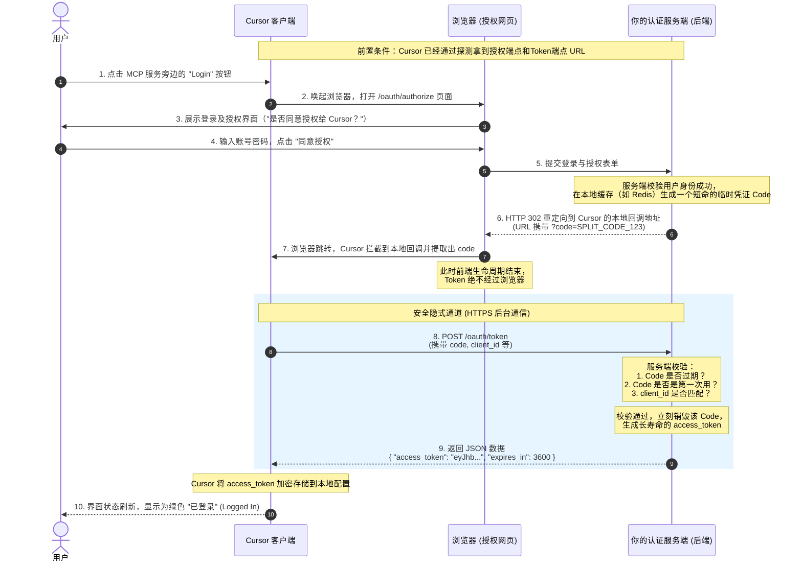
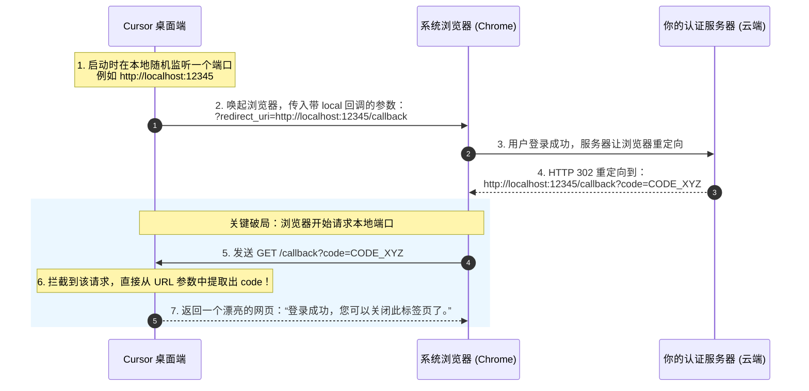

---
title: "OAuth远端认证流程"
weight: 5
---
# OAuth2.0标准远端认证流程

```mermaid
sequenceDiagram
    autonumber
    actor User as 用户
    participant Cursor as Cursor 客户端
    participant Browser as 浏览器 (授权网页)
    participant AuthServer as 你的认证服务端 (后端)

    Note over Cursor, AuthServer: 前置条件：Cursor 已经通过探测拿到授权端点和Token端点 URL
    
    User ->> Cursor: 1. 点击 MCP 服务旁边的 "Login" 按钮
    Cursor ->> Browser: 2. 唤起浏览器，打开 /oauth/authorize 页面
    Browser ->> User: 3. 展示登录及授权界面（"是否同意授权给 Cursor？"）
    User ->> Browser: 4. 输入账号密码，点击 "同意授权"
    
    Browser ->> AuthServer: 5. 提交登录与授权表单
    Note over AuthServer: 服务端校验用户身份成功，<br/>在本地缓存（如 Redis）生成一个短命的临时凭证 Code
    
    AuthServer -->> Browser: 6. HTTP 302 重定向到 Cursor 的本地回调地址<br/>(URL 携带 ?code=SPLIT_CODE_123)
    
    Browser ->> Cursor: 7. 浏览器跳转，Cursor 拦截到本地回调并提取出 code
    Note over Browser: 此时前端生命周期结束，<br/>Token 绝不经过浏览器
    
    rect rgb(230, 245, 255)
        Note over Cursor, AuthServer: 安全隐式通道 (HTTPS 后台通信)
        Cursor ->> AuthServer: 8. POST /oauth/token <br/>(携带 code, client_id 等)
        Note over AuthServer: 服务端校验：<br/>1. Code 是否过期？<br/>2. Code 是否是第一次用？<br/>3. client_id 是否匹配？
        Note over AuthServer: 校验通过，立刻销毁该 Code，<br/>生成长寿命的 access_token
        AuthServer -->> Cursor: 9. 返回 JSON 数据 <br/>{ "access_token": "eyJhb...", "expires_in": 3600 }
    end
    
    Note over Cursor: Cursor 将 access_token 加密存储到本地配置
    Cursor -->> User: 10. 界面状态刷新，显示为绿色 "已登录" (Logged In)
```

# 本地回环微型服务器（解析code）

```mermaid
sequenceDiagram
    autonumber
    participant Cursor as Cursor 桌面端
    participant Browser as 系统浏览器 (Chrome)
    participant Server as 你的认证服务器 (云端)

    Note over Cursor: 1. 启动时在本地随机监听一个端口<br/>例如 http://localhost:12345
    Cursor ->> Browser: 2. 唤起浏览器，传入带 local 回调的参数：<br/>?redirect_uri=http://localhost:12345/callback
    Browser ->> Server: 3. 用户登录成功，服务器让浏览器重定向
    Server -->> Browser: 4. HTTP 302 重定向到：<br/>http://localhost:12345/callback?code=CODE_XYZ
    
    rect rgb(235, 247, 255)
        Note over Browser, Cursor: 关键破局：浏览器开始请求本地端口
        Browser ->> Cursor: 5. 发送 GET /callback?code=CODE_XYZ
        Note over Cursor: 6. 拦截到该请求，直接从 URL 参数中提取出 code！
        Cursor -->> Browser: 7. 返回一个漂亮的网页：“登录成功，您可以关闭此标签页了。”
    end
    
```

